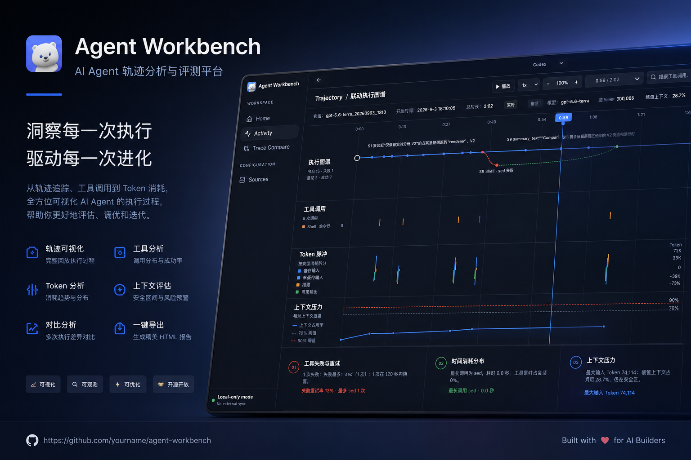

# Agent Workbench

本地优先的 Agent Session 分析工作台：把 Codex、Claude、WorkBuddy 与导入的 JSONL/Zstd 会话整理成可比较的 Turn/Run，并在浏览器中查看执行轨迹、证据和报告。



不会读取 Codex 页面、连接 CDP、开启注入，也不会默认把原始会话日志传到外部服务。

## 功能

- 只读发现本机 Codex、Claude、WorkBuddy 会话；支持导入 JSONL 与 Zstd 压缩日志。
- 按任务与 Turn 分析模型、Token、工具调用、失败恢复、上下文压力和执行耗时。
- 在同任务、可确认变量的前提下比较两次运行，并生成可离线打开的脱敏 HTML 报告。
- 提供确定性证据评分、手动评分，以及必须先预览并确认的 OpenAI 兼容 Judge。
- 本地状态只保存任务绑定和评分记录；导入日志驻留内存，不写回原始会话文件。

## 安装与启动

### 1. 准备环境

支持 macOS、Windows 和 Linux。需要 [Node.js](https://nodejs.org/) **22.15 或更高版本**；此版本要求来自 Node 原生 Zstd 解压能力。安装后，在终端确认版本：

```bash
node --version
npm --version
```

若 `node --version` 低于 `v22.15.0`，请先升级 Node.js；否则导入 `.zstd` 日志时会失败。

### 2. 下载并安装依赖

```bash
git clone https://github.com/minipopstyle/agent-workbench.git
cd agent-workbench
npm ci
```

`npm ci` 会严格按仓库中的 `package-lock.json` 安装，适合首次安装和复现环境。若你正在修改依赖，才使用 `npm install`。

### 已克隆用户：更新到最新版本

每次新开终端都会回到 `~`，所以请将下面整段命令一次复制执行；不要省略最前面的 `cd`：

```bash
cd ~/agent-workbench && git pull --ff-only && npm ci
```

随后按下文的方式启动服务。若克隆到了其他位置，请把 `~/agent-workbench` 换成实际目录。

### 3. 启动本地服务与界面

Agent Workbench 包含两个本地进程：

- **本地 API（后端）**：读取和分析会话，固定只监听 `127.0.0.1:47832`，不会暴露到局域网。
- **Web 界面（前端）**：浏览器页面，默认地址为 `http://localhost:5173`，通过本地代理调用 API。

#### 通用方式：一条命令临时启动

在项目目录执行：

```bash
cd ~/agent-workbench && npm run start
```

这会同时启动前后端；浏览器打开 `http://localhost:5173`。这个方式适合开发和临时使用：按 `Ctrl+C` 或关闭该终端，两个进程都会停止。

#### macOS 推荐方式：双击常驻启动

双击项目根目录中的 `Restart Agent Workbench.command`。它会启动前后端并交给 macOS 的 `launchd` 管理；命令窗口可以关闭，服务仍会持续运行。之后直接访问 `http://localhost:5173`。

需要完全停止时，双击 `Stop Agent Workbench.command`。它会停止两个常驻服务，并移除对应的本机启动配置。

> 两种方式不要同时使用。若正在运行 `npm run start`，请先按 `Ctrl+C`，再双击重启 command。

#### 分开启动（仅用于调试）

需要两个终端窗口；**每个新开的终端默认都在你的用户目录，必须先进入项目目录**，否则会出现 `Could not read package.json`。

**终端 A（本地 API）：**

```bash
cd ~/agent-workbench
npm run server
```

**终端 B（Web 界面）：**

```bash
cd ~/agent-workbench
npm run dev
```

如果克隆时用了不同的目录，请把两条命令中的 `~/agent-workbench` 替换为实际目录。Windows PowerShell 可使用：

```powershell
cd $HOME\agent-workbench
```

如默认 API 端口已被占用，可在启动终端 A 时更换端口：

```bash
# macOS / Linux
AGENT_WORKBENCH_PORT=47833 npm run server

# Windows PowerShell
$env:AGENT_WORKBENCH_PORT=47833; npm run server
```

### 从旧版迁移（macOS）

如果你曾使用旧项目中的 `Restart Agent Workbench.command`，它会注册一个常驻的 `launchd` 服务并占用默认 API 端口。先在**旧项目目录**运行 `Stop Agent Workbench.command`，再按本 README 启动新的克隆目录。不要同时运行两套服务。

可用下面的命令确认端口已经释放；没有输出才表示可以启动新版：

```bash
lsof -nP -iTCP:47832 -sTCP:LISTEN
```

## 使用方式

### 浏览与分析本机会话

1. 打开首页 `Sessions`。程序会以只读方式扫描本机可发现的 Codex、Claude 和 WorkBuddy 会话。
2. 用左侧来源、项目或搜索条件缩小范围，选择一个会话。
3. 打开会话后，选择需要查看的 Turn；在“分析结果”查看执行时长、Token、工具调用、失败/重试、上下文压力和证据。
4. 切换到“轨迹”查看按步骤排列的执行过程；可生成该次运行的本地执行报告。

扫描不到会话并不代表源日志丢失：通常只是对应客户端尚未在本机创建过会话，或其本地存储位置不在当前支持范围内。

### 导入 JSONL 或 Zstd 日志

1. 进入 `Trace Compare`。
2. 在 Baseline A 或 Candidate B 卡片中点“导入”。
3. 选择 `.jsonl`、`.zstd` 或 `.jsonl.zstd` 文件。
4. 导入后可直接查看或与另一条会话比较；如需下次仍保留该导入结果，点 `Save A` 或 `Save B`。

导入内容默认只存在内存中。保存操作仅保存规范化后的分析快照，不会修改或复制原始 JSONL/Zstd 文件。

### 对比两次 Agent 运行

适合比较同一任务的不同模型、提示词、配置或执行策略。

1. 在 `Sessions` 中分别选中两条会话，指定 A（基准）与 B（候选），再点“对比”；也可以直接进入 `Trace Compare` 的两个下拉框选择。
2. 如有必要，为每条会话选择特定 Turn；留空时使用最新 Turn。
3. 查看结果中的完成情况、Token/耗时、工具稳定性、上下文压力、关键分歧与建议。
4. 选择优化目标（平衡、质量、成本、速度或可靠性）来调整阅读视角；结论会保留原始指标，不用单一分数掩盖取舍。

只有在两次运行确实对应同一个任务、且关键变量可确认时，才应把比较当作控制变量结论；否则它只是探索性对比。

### 导出报告

在比较结果右上角点“导出报告”，可选：

- **HTML 可视化报告**：推荐用于本地保存或分享，可离线打开。
- **报告数据 JSON**：结构化的比较结论和指标。
- **完整分析 JSON**：包含完整分析 bundle，适合二次处理。

导出前仍建议人工检查内容是否满足你的数据处理要求。

## 常用命令

```bash
npm test       # 单元与导入回归测试
npm run build  # TypeScript 检查与生产构建
npm run lint   # 静态检查
npm run preview # 本地预览生产构建（先执行 npm run build）
npm run start  # 同时启动本地 API 与 Web 界面
```

## 常见问题

**页面显示无法连接本地 API**

确认 `npm run start` 仍在运行，或 macOS 常驻服务已通过 `Restart Agent Workbench.command` 启动，并使用同一台电脑上的浏览器打开开发地址。若更改了 `AGENT_WORKBENCH_PORT`，请重启前端开发服务，使其使用相同的 API 地址。

**`npm ci` 失败或 Node 版本不满足要求**

运行 `node --version` 确认版本至少为 22.15。升级 Node 后，删除当前安装目录中的 `node_modules`，再执行 `npm ci`。

**无法导入 `.zstd` 文件**

先确认 Node 版本至少为 22.15，并确认文件本身是 Zstd 压缩的会话日志。对于普通 JSONL，请直接选择 `.jsonl` 文件。

**端口已被占用**

按上文设置 `AGENT_WORKBENCH_PORT` 后，还需把 `vite.config.ts` 中 `proxy: { '/api': 'http://127.0.0.1:47832' }` 的端口改为相同数值，再重启前端开发服务。Vite 若发现 `5173` 被占用，通常会自动选择另一个可用端口，并把实际地址打印在终端中。

## 隐私与可选 Judge

所有会话分析默认在本机完成。Judge 仅在界面中显示脱敏预览、并由用户明确确认后才会调用外部 OpenAI 兼容接口。

如需启用 Judge，启动服务前设置：

```bash
export AGENT_WORKBENCH_JUDGE_BASE_URL="https://example.com/v1"
export AGENT_WORKBENCH_JUDGE_API_KEY="..."
export AGENT_WORKBENCH_JUDGE_MODEL="..."
```

预览与报告会移除本机路径、URL、常见凭证字段，以及 OpenAI、GitHub、Slack、AWS、Google、Hugging Face 与 GitLab 等令牌格式。仍请在分享前检查内容是否符合你的数据处理要求。

## 项目结构

- `src/`：React 界面与可视化。
- `server/`：本地 API、会话适配器、比较、评分与报告生成。
- `tests/`：导入、分析、比较、评分与状态持久化回归测试。
- `public/legacy-v2/`：保留的离线 V2 轨迹视图。

## 开发边界

本项目面向本地个人分析，不是托管遥测平台；源日志保持只读，外部 Judge 是可选功能。
